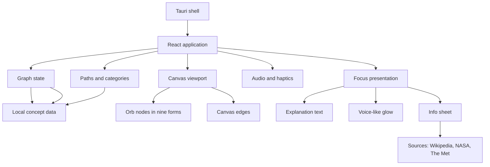

# Architecture

## Goal

The implementation should support an open, nested concept graph with two presentation states:

1. **Explore:** pan and zoom a free-flowing network; tap nodes to reveal deeper connections.
2. **Focus:** hold a node to center it and show a short explanation.

The Markdown documentation is the design source of truth. The prototype implements it; the older chat-style experience has been removed.

## System shape



## Recommended source layout

```text
content/                       # the network as data (see content/README.md)
├── concepts/                  # one JSON file per cluster of ideas
├── links/                     # themed lists of extra cross-links
├── categories/                # one JSON file per learning path
├── depth/                     # four-layer explanations and prerequisites
└── library/                   # faculties and departments
src/
├── app/
│   ├── Root.tsx               # routes between library, page, and map
│   └── App.tsx                # the map view: canvas, focus, info sheet, paths
├── concepts/
│   ├── concepts.ts            # loads content/ into ConceptNode[]
│   ├── tone.ts                # voice → blue, speed, intensity
│   └── types.ts
├── graph/
│   ├── ConceptCanvas.tsx      # scene loop: camera, drift, emergence, edges, orb painting
│   ├── ConceptNode.tsx
│   ├── graph-layout.ts        # stable world positions
│   ├── model.ts               # graph built from the concept data
│   ├── navigation.ts          # trail reducer and derived node roles
│   ├── orb-paint.ts           # the nine thinking-orbs forms, painted in blue
│   └── useViewport.ts         # spring camera
├── focus/
│   ├── FocusView.tsx
│   └── VoiceGlow.tsx
├── library/                   # the library home, concept pages, cards, hash routing, depth data
├── sheet/                     # the info sheet and its source cards
├── sources/                   # Wikipedia, NASA, The Met, cache (see SOURCES.md)
├── paths/                     # categories, the picker, the path strip
├── interaction/
│   ├── usePressGesture.ts
│   ├── useInteractionSound.ts
│   └── useReducedMotion.ts
├── styles/
│   ├── app.css
│   └── sheets.css
└── main.tsx
tools/
└── validate-content.mjs       # npm run check:content
```

`ConceptNode` gained `layer`, `orb`, and `sources` fields, and `AppState.visibleNodeIds` is not stored: visibility is derived from the navigation trail, so going back simply un-derives the previous depth.

## Concept model

```ts
type ConceptTone = {
  blue: string;
  speed: number;
  intensity: number;
  voice: "restless" | "precise" | "layered" | "human" | "quiet" | "mechanical" | "vast" | "lucid";
};

type ConceptNode = {
  id: string;
  title: string;
  summary: string;
  parentIds: string[];
  relatedIds: string[];
  tone: ConceptTone;
  orb: OrbState;                 // one of the nine thinking-orbs forms
  sources: { wikipedia?: string; nasa?: string; met?: string };
  safety?: "general" | "sensitive";
  layer?: 1 | 2;
};
```

Multiple parents and explicit related links allow the content to behave like a network instead of a strict tree.

## Application state

```ts
type AppState = {
  activeRootId: string;
  visibleNodeIds: string[];
  focusedNodeId: string | null;
  navigationStack: string[];
  viewport: { x: number; y: number; scale: number };
  reducedMotion: boolean;
};
```

Keep navigation state separate from presentation state. A focused node is not a new route depth; it is a temporary view of the current node.

## Rendering strategy

- Render each interactive node as a real button for keyboard and screen-reader support.
- Give each node the `thinking-orbs` form its concept specifies (nine exist), painted from the engine's frames in the concept's blue.
- Mount only what is on screen (plus what is still fading out). A large network costs nothing until it is visible.
- Draw edges on one canvas rather than as hundreds of SVG paths, and repaint orbs at a rate that matches their role.
- Store stable node positions to prevent the graph from jumping after focus mode. Positions are computed once from the data: each subtree opens radially outward from the root, and a short force pass separates only the ideas that can appear together.
- Apply a small drift, then constrain motion so labels remain readable.
- Transform one shared viewport layer for pan and zoom.
- Show at most a handful of cross-linked ideas around the center, and keep every link reachable from the info sheet.

The DOM holds a few dozen nodes at a time and the canvas draws only those, so the network can grow to thousands of concepts. If it ever needs to, orb painting can move into one shared canvas or WebGL layer while a small accessible DOM layer keeps buttons and labels.

## Performance

The canvas loop is the only thing that runs every frame, and its cost follows what is visible, not the size of the network.

- **Virtualized nodes.** A concept is mounted only while it is on screen or fading out. Opening view: about ten. Deep in the network: about twenty.
- **Cadence by role.** The center repaints every frame, its children every second, the trail every third, and receded orbs once. Held focus repaints only the held orb.
- **Batched dots.** Each orb groups its dots by color and opacity and fills each group once, roughly twice as fast as filling every dot separately.
- **One edge canvas** replaces hundreds of SVG paths and their per-frame attribute writes.
- **No always-on filters.** Blur and drop-shadow filters are applied only while pressing or focusing.
- **Layout** is computed once at startup (a few hundred milliseconds for about 480 concepts) and is deterministic.
- In development, `window.__orbPerf` reports the average and worst cost of a frame's own work, and how many nodes are mounted.

## Gesture state machine

```text
pointer down
├── movement exceeds threshold → canvas drag
├── released before hold delay → node tap / expand
└── hold delay reached → node focus
```

Cancel the hold timer when movement exceeds the drag threshold, the pointer leaves the target, or the gesture is interrupted. Avoid firing a tap after a successful hold.

## Focus sequence

```text
idle
  → holding
  → focus confirmed
  → center node + fade graph
  → thinking glow
  → explanation visible
  → exit
  → restore graph and viewport
```

## Sound and haptics

Use the Web Audio API to synthesize brief sounds locally. Do not require bundled audio files. Haptics should be progressive enhancement through the platform when available.

Both must respect user and operating-system preferences.

## Tauri boundary

The first version can remain entirely local. Tauri provides the native window and future secure capabilities, while the React layer owns content and interaction.

Outside content is fetched on demand from Wikipedia, NASA, and The Met; see [SOURCES.md](SOURCES.md) for how, and for moving that into a Tauri command.

If model-generated explanations are added later, call them through a Tauri command or trusted service boundary. Keep credentials out of frontend code, send only the selected concept context, stream into the existing glow state, and preserve curated local explanations as an offline fallback.

## Accessibility

- Nodes are buttons with their concept title as the accessible name.
- Keyboard Enter expands a node; Space or a dedicated details shortcut opens focus.
- Focus is restored to the originating node after leaving the explanation.
- The explanation is announced through a polite live region.
- Lines and animation are supplementary; labels and structure carry the meaning.
- Reduced-motion behavior follows [INTERACTIONS.md](INTERACTIONS.md).

## Content safety

Sensitive topics can be represented in the graph while their content remains scoped. Firearms and similar mechanisms should cover general operation, history, consequences, and safety, without actionable construction, modification, optimization, or evasion instructions.

