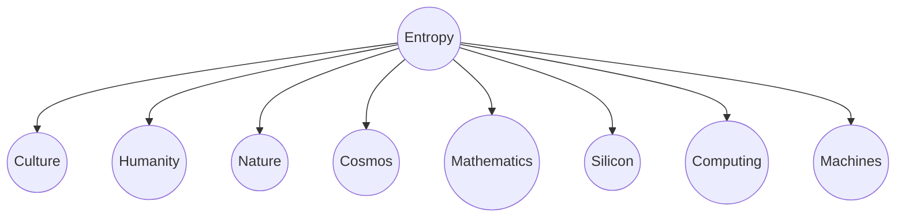
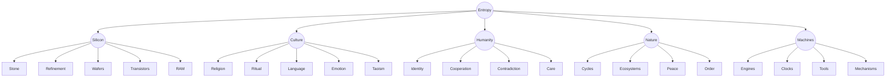

# Content map

The concepts themselves live in [`content/`](content/README.md) as JSON, one file per cluster, and this document explains how they are organized. It replaces the original five-branch sketch: the network now has **eight entrances**, **900 concepts**, and runs nine levels deep, with 489 of them explained in full (see [LIBRARY.md](LIBRARY.md)).

## Starting network



### Why these eight

The entrances are meant to reach everything else from the fewest, most distinct starting points. Together they cover four kinds of question:

| Kind | Entrances | The question |
| --- | --- | --- |
| The physical world | **Cosmos**, **Nature** | What is here, at the largest scale and at the scale we live on? |
| The made world | **Silicon**, **Computing**, **Machines** | What have people built, and how does it work? |
| The meant world | **Culture**, **Humanity** | What do we make of it, and what are we? |
| The abstract | **Mathematics** | What holds it all together? |

Neighbors around the ring lean on each other (Culture beside Humanity; Cosmos beside Mathematics; Silicon beside Computing), so cross-links between adjacent entrances stay short. Silicon and Computing are separate on purpose: one is the story of a physical material, the other of what runs on it.

Entropy stays at the center because it connects the physical and personal sides of the network: energy spreading, structure decaying, time having a direction, and people making temporary islands of order.

Tapping Entropy a second time opens six lenses on it: Arrow of Time, Decay & Renewal, Local Order, Information, Waste Heat, and Emergence.

### How the branches deepen

```text
Cosmos      → Stars → Neutron stars → Pulsars, Magnetars, Degenerate matter
            → Black holes → Event horizon, Hawking radiation, Information paradox
            → Heat death → Equilibrium, Boltzmann brain, Ultimate fate
            → Light → Photons → Quantum mechanics → Uncertainty, Entanglement, Measurement
Culture     → Art → Music → Music theory → Scales → Modes · Tuning → Harmonic series
            → History → Middle Ages → Renaissance → Perspective, Printing press, Leonardo
            → Language → Grammar, Semantics, Writing → Alphabet
            → Emotion → Love → Attachment, Friendship, Family, Forgiveness
            → Taoism → Non-forcing, Boundaries, Regret
Computing   → Networks → IP → TCP, Routing → BGP · DNS → Domain names
            → Security → Cryptography → TLS · Authentication → JWT, OAuth · Web attacks → XSS, CSRF
            → Infrastructure → Servers → nginx, Reverse proxy → Rate limiting · Containers → Docker
Silicon     → Stone → Refinement → Crystal ingot → Wafers → Lithography → Transistors → RAM
Mathematics → Proof → Truth → Knowledge → Reality → Existence → Nothing → Emptiness
            → Logic → Argument → Fallacies → Ad hominem, Straw man, False dilemma, Post hoc
                                → Cognitive biases → Confirmation bias, Anchoring, Sunk cost
            → Logic → Algorithms → Sorting → Merge sort, Quicksort · Graph algorithms → Dijkstra
                                → Dynamic programming → Memoization · Computability → Halting problem
            → Calculus → Limits → Derivatives → Chain rule · Integrals → Fundamental theorem
                                → Series → Taylor series · Differential equations → Heat equation
            → Probability → Bayes' theorem · Distributions → Normal · Statistics → Hypothesis testing
Computing   → Data → Data structures → Hash tables · Trees → B-trees · Graphs → DAGs
```

The deepest ideas (truth, knowledge, reality, existence, nothing, emptiness, meaning, causality) are reached from many directions and carry the most cross-links. Every path, sooner or later, arrives at them.

### Links

Ideas are densely linked, about eight cross-links each, and a link is meant to be something a curious person would want to follow. Love, for instance, connects to care, grief, music, story, family, memory, death, religion, and evolution. Only the closest few are drawn around the center; the info sheet lists all of them.

### Paths

Forty-five short trails through the network, in six groups: **Me** (Entropy & Taoism, Stone to Chip, How Machines Work, Care & Its Limits, Nature & Stillness), **Tech** (Software & Data, Networking, The Web, Cryptography & TLS, Auth, Web Attacks, Linux & nginx, Containers & the Cloud, Machine Intelligence, Data Structures, Algorithms, Limits of Computation, Number Theory & Sketches), **People** (including Biases of the Mind), **Science**, **Culture**, and **Abstract** (Reasoning & Debate, Fallacies, Calculus in four parts, Linear Algebra). They live in `content/categories/`.

## The original sketch

The first content map, kept for reference, showed only the five original branches and their immediate children:



All of those ideas are still present, in the same places.

## Entropy

Entropy is the root lens: the tendency for energy to spread and for ordered states to require work to maintain.

Possible child ideas:

- the arrow of time;
- decay and renewal;
- local order inside wider disorder;
- information and uncertainty;
- waste heat;
- why complexity can still emerge.

## Silicon

Silicon follows the transformation of common matter into precise information machinery.

Example path:

```text
Entropy → Silicon → Stone → Refinement → Crystal ingot → Wafer
        → Lithography → Transistor → Memory cell → RAM
```

The important idea is the contrast: ordinary rock becomes one of the most controlled and complicated objects humans can manufacture.

## Culture

Culture explores how meaning survives by changing.

Possible children:

- language and symbols;
- religion and belief;
- rituals and institutions;
- emotion across historical periods;
- technology changing social behavior;
- Taoism and acting without forcing.

### Taoism, care, and regret

One possible reflection begins with this thought: helping someone can still have value even when the outcome harms or exhausts the helper. The lesson does not have to be “I should regret caring.” It may instead be “care needs awareness, limits, and less attachment to controlling the result.”

This should be presented as a personal philosophical connection, not as a definitive account of Taoism. From here the network could open into non-forcing, compassion, boundaries, intention, consequence, and regret.

## Humanity

Humanity turns the network back toward the creature building it.

Possible children:

- consciousness and attention;
- identity and memory;
- cooperation and conflict;
- love, fear, shame, and hope;
- individual needs versus group survival;
- the human ability to create and destroy.

## Nature

Nature offers both mechanism and scale.

Possible children:

- ecosystems and interdependence;
- cycles of growth and decay;
- emergence and self-organization;
- weather, water, stone, and life;
- peace as stillness, balance, or acceptance;
- humanity as part of nature rather than outside it.

## Machines

Machines explain how parts constrain energy into predictable behavior.

Possible children:

- engines: pressure, heat, motion, and efficiency;
- clocks: oscillation, regulation, and measurement;
- tools: leverage, force, and extension of the body;
- mechanisms: input, constraint, transfer, and output;
- firearms: high-level mechanical principles, history, social effects, and safety.

Weapons content should remain educational and non-operational. It should not provide construction, modification, optimization, or evasion guidance.

## Example cross-links

- Entropy ↔ Engines: useful motion always produces waste heat.
- Silicon ↔ Culture: communication technology changes language and social behavior.
- Culture ↔ Humanity: beliefs shape identity; human needs reshape beliefs.
- Nature ↔ Peace: attention to natural cycles can change the experience of time.
- Machines ↔ Humanity: tools extend ability while also changing behavior.
- Taoism ↔ Nature: non-forcing can be explored through flow, adaptation, and limits.

